# Sistema Hospitalario 

&nbsp;  
&nbsp;  
&nbsp;  
&nbsp;  
&nbsp;  

**DANIEL ESTEBAN GUERRERO QUINTERO**  
**AURA CAMILA PICO ARAQUE**

&nbsp;  
&nbsp;  
 
**S1**  
&nbsp;  
&nbsp;  
&nbsp;  

**PEDRO FELIPE GÓMEZ BONILLA**  

&nbsp;  
&nbsp;  
&nbsp;  

**CAMPUSLANDS**  
**ARTEMIS**  
**RUTA NODEJS**  
**BUCARAMANGA**  
**CAJASAN**
**2025**
 

 

#

 
 

## Tabla de Contenidos

- [Introducción](#introducción)
- [Caso de Estudio](#caso-de-estudio)
- [Planificación](#planificación)
- [Construcción del Modelo Conceptual](#construcción-del-modelo-conceptual)
  - [Descripción](#descripción)
  - [Gráfica](#gráfica)
  - [Descripción Técnica](#descripción-técnica)
- [Construcción del Modelo Lógico](#construcción-del-modelo-lógico)
  - [Descripción](#descripción-1)
  - [Gráfica](#gráfica-1)
  - [Descripción Técnica](#descripción-técnica-1)
- [Normalización del Modelo Lógico](#normalización-del-modelo-lógico)
  - [Primera Forma Normal (1FN)](#primera-forma-normal-1fn)
    - [Descripción](#descripción-2)
    - [Gráfica](#gráfica-2)
    - [Descripción Técnica](#descripción-técnica-2)
  - [Segunda Forma Normal (2FN)](#segunda-forma-normal-2fn)
    - [Descripción](#descripción-3)
    - [Gráfica](#gráfica-3)
    - [Descripción Técnica](#descripción-técnica-3)
  - [Tercera Forma Normal (3FN)](#tercera-forma-normal-3fn)
    - [Descripción](#descripción-4)
    - [Gráfica](#gráfica-4)
    - [Descripción Técnica](#descripción-técnica-4)
- [Construcción del Modelo Físico](#construcción-del-modelo-físico)
  - [Descripción](#descripción-5)
  - [Código](#código)
  - [Descripción Técnica](#descripción-técnica-5)
- [Diagrama E-R](#diagrama-e-r)
  - [Descripción](#descripción-6)
  - [Gráfica](#gráfica-5)
  - [Descripción Técnica](#descripción-técnica-6)
- [Tablas](#tablas)
  - [Descripción](#descripción-7)
  - [Gráfica](#gráfica-6)
  - [Descripción Técnica](#descripción-técnica-7)
- [Relaciones entre Tablas](#relaciones-entre-tablas)
  - [Descripción](#descripción-8)
  - [Gráfica](#gráfica-7)
  - [Descripción Técnica](#descripción-técnica-8)
- [Inserción de Datos](#inserción-de-datos)
  - [Descripción](#descripción-9)
  - [Gráfica](#gráfica-8)
  - [Descripción Técnica](#descripción-técnica-9)
- [Referencias](#referencias)

 
 

#  🏥 Sistema Hospitalario 

El objetivo del proyecto es diseñar y desarrollar un sistema de base de datos en **MongoDB** que permita gestionar de manera eficiente todas las operaciones relacionadas con la administración de un **Sistema Hospitalario**. Dicho sistema incluirá la gestión de hospitales, pacientes, médicos, tratamientos, medicamentos, visitas médicas, historiales clínicos, áreas especializadas y personal administrativo.

## Introducción

El sistema propuesto busca facilitar la gestión de hospitales, pacientes, personal médico y administrativo, áreas especializadas, tratamientos, medicamentos, visitas médicas e historiales clínicos. Además, se incluirán mecanismos de autenticación y control de acceso basados en roles para garantizar la seguridad y privacidad de la información. A través de consultas optimizadas y funciones re utilizables, se pretende brindar a los usuarios herramientas para la toma de decisiones, el control de inventario, el análisis de datos clínicos y la mejora continua en la atención médica.

## Caso de Estudio

Cada hospital cuenta con diferentes especialidades médicas y un equipo multidisciplinario conformado por médicos especialistas, enfermeros, personal administrativo y de mantenimiento. La administración general está a cargo de un director que supervisa tanto la parte médica como la operativa.

En el sistema actual, gran parte de la información se encuentra almacenada en formatos físicos o dispersa en múltiples archivos digitales sin una estructura unificada, lo que dificulta la gestión efectiva de los recursos, el seguimiento de pacientes y la elaboración de reportes médicos y administrativos.

Con el desarrollo de este sistema en MongoDB, se busca centralizar y estructurar toda la información relevante, permitiendo registrar visitas médicas, diagnósticos, tratamientos, disponibilidad de medicamentos, y la actividad del personal. Además, se podrá generar estadísticas, visualizar historiales clínicos completos y realizar consultas avanzadas que respalden las decisiones clínicas y administrativas. Este enfoque no solo mejora la eficiencia interna del hospital, sino que también garantiza una mejor calidad de atención al paciente.

# Planificación

## Construcción del Modelo Conceptual

### Descripción

 

## 📁 Estructura Modelo Conceptual

### 1. 🏥 `hospitales`

Representa los hospitales del sistema.

-   `idHospital`: ObjectId (PK) – Identificador único del hospital
    
-   `nombre`: String – Nombre del hospital
    
-   `ubicacion`: String – Dirección o ciudad
    
-   `telefono`: String – Número de contacto
    
-   `idDirector`: Ref → `personal` – Hace referencia al director general (tipo 001)
    
-   `areasEspecializadas`: [Ref → `areasEspecializadas`] – Áreas que conforman el hospital
    
-   `personal`: [Ref → `personal`] – Médicos, administrativos, enfermeros y otros
    
-   `pacientes`: [Ref → `pacientes`] – Pacientes registrados en el hospital
    
#

### 2. 🧠 `areasEspecializadas`

Define las especialidades médicas disponibles.

-   `idArea`: ObjectId (PK) – Identificador único del área

-   `nombre`: String – Nombre del área (ej. Cardiología, Pediatría)
    
-   `descripcion`: String – Descripción general del área

- `hospital_asignado`:  Ref → hospitales *(Requerido)*  
#
    
### 3. 🧠 `personal` (OPCIONAL )
Unificar los cargos en una sola colección para en un momento de consultas sean simples y minimizar la duplicación de estructura entre colecciones al igual que validaciones mas simples 👍

#### 3.1 🏛️ `directoresGenerales`

Estructura ampliada de directores generales con todos los campos.

- `idDirector`: ObjectId *(Primary Key)*  
- `tipo_personal`: String *(Requerido)*  
- `numero_documento`: String *(Requerido)*  
- `nombre_completo`: String *(Requerido)*  
- `rol`: String *(Requerido)*  
- `telefono`: String *(Requerido)*  
- `correo_electronico`: String *(Requerido)*  
- `salario`: Number *(Requerido)*  
- `fecha_ingreso`: Date *(Requerido)*  
- `hospitales_asignados`: Ref → hospitales*(Requerido)*  

---

#### 3.2 🩺 `medicosEspecialistas`

- `idMedico`: ObjectId *(Primary Key)*  
- `tipo_personal`: String *(Requerido)*  
- `numero_colegiatura`: String *(Requerido)*  
- `nombre_completo`: String *(Requerido)*  
- `especialidad`: String *(Requerido)*  
- `telefono`: String *(Requerido)*  
- `correo_electronico`: String *(Requerido)*  
- `salario`: Number *(Requerido)*  
- `hospital_asignado`: Ref → hospitales *(Requerido)*  
---

#### 3.3 🩹 `personalEnfermeria`

- `idEnfermero`: ObjectId *(Primary Key)*  
- `tipo_personal`: String *(Requerido)*  
- `numero_documento`: String *(Requerido)*  
- `nombre_completo`: String *(Requerido)*  
- `area_asignada`: String *(Requerido)*  
- `telefono`: String *(Requerido)*  
- `correo_electronico`: String *(Requerido)*  
- `salario`: Number *(Requerido)*  
- `hospital_asignado`: Ref → hospitales *(Requerido)*  
---

#### 3.4.1 💼 `personalAdministrativo`

Estructura del personal administrativo del sistema hospitalario.

- `idAdministrativo`: ObjectId *(Primary Key)*  
- `tipo_personal`: String *(Requerido)*  
- `numero_documento`: String *(Requerido)*  
- `nombre_completo`: String *(Requerido)*  
- `cargo`: String *(Requerido)*  
 [
    - `"Asistente de Gestión Humana"`  
    - `"Coordinador Financiero"`  
    - `"Recepcionista Principal"`
  ]
- `telefono`: String *(Requerido)*  
- `correo_electronico`: String *(Requerido)*  
- `salario`: Number *(Requerido)*  
- `hospital_asignado`: Ref → hospitales*(Requerido)*  
---

#### 3.5 🧹 `personalAseoYServicios`

Estructura del personal de aseo y servicios generales.

- `idPersonalAseo`: ObjectId *(Primary Key)* 
- `tipo_personal`: String *(Requerido)*  
- `numero_documento`: String *(Requerido)*  
  - Documento de identidad (10 dígitos).  
- `nombre_completo`: String *(Requerido)*  
  - Nombre completo del empleado.  
- `funcion`: String *(Requerido)*  
  - Descripción específica de sus labores.  [
    - `"Limpieza de áreas quirúrgicas"`  
    - `"Aseo de habitaciones"`  
    - `"Mantenimiento de áreas comunes"`
]
- `telefono`: String *(Requerido)*   
- `correo_electronico`: String *(Opcional)*  
- `salario`: Number *(Requerido)*  
- `hospital_asignado`:  Ref → hospitales *(Requerido)*  
    
#
### 4. 🧍 `pacientes`

Información de los pacientes registrados.

-   `idPaciente`: ObjectId (PK)
      
-   `numeroHistoriaClinica`: String – Código único
    
-   `nombre`: String
    
-   `direccion`: String
    
-   `telefono`: String
    
-   `correo`: String
    
-   `segurosMedicos`: [Ref → `segurosMedicos` :  `nombre`: String , `compañia`: String  ]
    
-   `historialClinico`: [Ref → `historialesClinicos`: -   `idPaciente`: Ref →[ `pacientes`] , `diagnostico`: String ,	`tratamientos`: [Ref → 	`tratamientos`]	,`resultados`: String`fecha`: Date ]

- `hospital_asignado`:  Ref → hospitales *(Requerido)*  

#
### 5. 💳 `segurosMedicos`

Listado de aseguradoras y entidades médicas.

-   `idSeguro`: ObjectId (PK)
    
-   `nombre`: String
    
-   `compañia`: String (opcional)

-    `tipo_seguro` :  String 
    

#
### 6. 📋 `historialesClinicos`

Registro médico del paciente.

-   `idHistorial`: ObjectId (PK)
    
-   `idPaciente`: Ref → `pacientes`
 	
-   `tipo de especialista`:  Ref → `areasEspecializadas` :  String
 	
-    `médico_responsable` :  Ref → `idMedico , idEnfermero `
 	    
-    `Motivo de la consulta` :    *String (Requerido)*

-   `diagnostico`: String
    
-   `tratamientos`: [Ref → `tratamientos`]
    
-   `resultados`: String
    
-   `fecha`: Date
    
- `hospital_asignado`:  Ref → hospitales *(Requerido)*  

#
### 7. 💉 `tratamientos`

Procedimientos realizados al paciente.

-   `idTratamiento`: ObjectId (PK)
    
-   `nombre`: String
    
-   `descripcion`: String
    
-   `areaMedica`: Ref → `areasEspecializadas`

-    `Plan de tratamiento` : String

-    `duracion_estimada` :  String
    
-   `costo`: Number
    
-   `medicamentosUsados`: [Ref → `medicamentos`]

- `hospital_asignado`:  Ref → hospitales *(Requerido)*  
    
#
### 8. 💊 `medicamentos`

Inventario de medicamentos disponibles.

-   `idMedicamento`: ObjectId (PK)
    
-   `nombre`: String
    
-   `fabricante`: String
    
-   `tipo`: String (ej. analgésico, antibiótico)

-    `dosis_estandar` :  String  (Requerido)

-   `Frecuencia` :   String  (Requerido)

-   `Vía de administración`  :    String  (Requerido)

-   `Reacciones adversas` :    String  (Requerido)
    
-   `inventario`: Number
    
- `hospital_asignado`:  Ref → hospitales *(Requerido)*  
- 
#

### 9. 📆 `visitasMedicas`

Registro de las atenciones médicas.

-   `idVisita`: ObjectId (PK)
    
-   `tipo_visita` :  String  (Requerido)

-	 `observaciones` :   String  (Requerido)

-   `fecha`: Date
    
-   `hora`: String
    
-   `medicoAsignado`: Ref → `personal` (tipo 002)
    
-   `pacienteAtendido`: Ref → `pacientes`
    
-   `diagnostico`: String

- `hospital_asignado`:  Ref → hospitales *(Requerido)*  

 #
Analizar quienes tendran el `permisos: ["ver_pacientes", "editar_visitas"]`   para modelar los roles y el acceso de un array de permisos

# 

### (OPCIONAL)
tener en cuenta implementar o no **Citas y turnos** (gestión de tiempos)  , **Inventario y facturación** (gestión operativa y financiera) , Consentimientos, Reportes, Alertas, Adjuntos, Encuestas  

 

# Gráfica

```mermaid

graph TD

  

%% Entidades principales

Hospitales[Hospitales]

Areas[AreasEspecializadas]

Pacientes[Pacientes]

Seguros[SegurosMedicos]

Historial[HistorialesClinicos]

Tratamientos[Tratamientos]

Medicamentos[Medicamentos]

Visitas[VisitasMedicas]

  

%% Personal dividido en roles

Directores[DirectoresGenerales]

Medicos[MedicosEspecialistas]

Enfermeros[PersonalEnfermeria]

Administrativos[PersonalAdministrativo]

Aseo[PersonalAseoYServicios]

  

%% Atributos Hospitales

idHospital((idHospital))

nombreHospital((nombre))

ubicacionHospital((ubicacion))

telefonoHospital((telefono))

Hospitales --> idHospital

Hospitales --> nombreHospital

Hospitales --> ubicacionHospital

Hospitales --> telefonoHospital

Hospitales -->|dirigido por| Directores

Hospitales -->|tiene áreas| Areas

Hospitales -->|tiene personal| Directores

Hospitales --> Directores

Hospitales --> Medicos

Hospitales --> Enfermeros

Hospitales --> Administrativos

Hospitales --> Aseo

Hospitales -->|atiende a| Pacientes

  

%% Areas Especializadas

idArea((idArea))

nombreArea((nombre))

descArea((descripcion))

Areas --> idArea

Areas --> nombreArea

Areas --> descArea

Areas -->|pertenece a| Hospitales

  

%% Personal General

Directores -->|trabaja en| Hospitales

Medicos -->|trabaja en| Hospitales

Enfermeros -->|trabaja en| Hospitales

Administrativos -->|trabaja en| Hospitales

Aseo -->|trabaja en| Hospitales

  

%% Pacientes

idPaciente((idPaciente))

nombrePaciente((nombre))

direccion((direccion))

telefono((telefono))

correo((correo))

historia((numeroHistoriaClinica))

Pacientes --> idPaciente

Pacientes --> nombrePaciente

Pacientes --> direccion

Pacientes --> telefono

Pacientes --> correo

Pacientes --> historia

Pacientes -->|tiene seguro| Seguros

Pacientes -->|tiene historial| Historial

Pacientes -->|hospitalizado en| Hospitales

  

%% Seguros Médicos

idSeguro((idSeguro))

nombreSeguro((nombre))

compania((compañia))

tipoSeguro((tipo_seguro))

Seguros --> idSeguro

Seguros --> nombreSeguro

Seguros --> compania

Seguros --> tipoSeguro

  

%% Historial Clínico

idHistorial((idHistorial))

motivo((MotivoConsulta))

diagnostico((diagnostico))

resultados((resultados))

fechaHistorial((fecha))

Historial --> idHistorial

Historial --> motivo

Historial --> diagnostico

Historial --> resultados

Historial --> fechaHistorial

Historial -->|de paciente| Pacientes

Historial -->|requiere tratamiento| Tratamientos

Historial -->|realizado por| Medicos

Historial -->|realizado por| Enfermeros

Historial -->|área médica| Areas

Historial -->|hospital| Hospitales

  

%% Tratamientos

idTratamiento((idTratamiento))

nombreTratamiento((nombre))

descripcionTratamiento((descripcion))

plan((PlanTratamiento))

duracion((duracion_estimada))

costo((costo))

Tratamientos --> idTratamiento

Tratamientos --> nombreTratamiento

Tratamientos --> descripcionTratamiento

Tratamientos --> plan

Tratamientos --> duracion

Tratamientos --> costo

Tratamientos -->|usa| Medicamentos

Tratamientos -->|área| Areas

Tratamientos -->|hospital| Hospitales

  

%% Medicamentos

idMed((idMedicamento))

nombreMed((nombre))

fabricante((fabricante))

tipoMed((tipo))

dosis((dosis_estandar))

frecuencia((Frecuencia))

via((VíaAdministración))

reacciones((ReaccionesAdversas))

inventario((inventario))

Medicamentos --> idMed

Medicamentos --> nombreMed

Medicamentos --> fabricante

Medicamentos --> tipoMed

Medicamentos --> dosis

Medicamentos --> frecuencia

Medicamentos --> via

Medicamentos --> reacciones

Medicamentos --> inventario

Medicamentos -->|disponible en| Hospitales

  

%% Visitas Médicas

idVisita((idVisita))

tipoVisita((tipo_visita))

observaciones((observaciones))

fechaVisita((fecha))

hora((hora))

diagnosticoVisita((diagnostico))

Visitas --> idVisita

Visitas --> tipoVisita

Visitas --> observaciones

Visitas --> fechaVisita

Visitas --> hora

Visitas --> diagnosticoVisita

Visitas -->|realizada por| Medicos

Visitas -->|atendió a| Pacientes

Visitas -->|hospital| Hospitales

```

