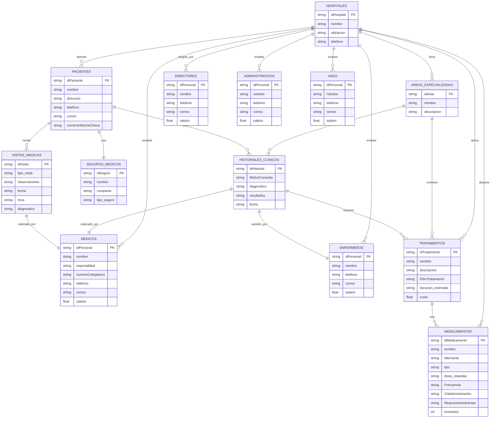
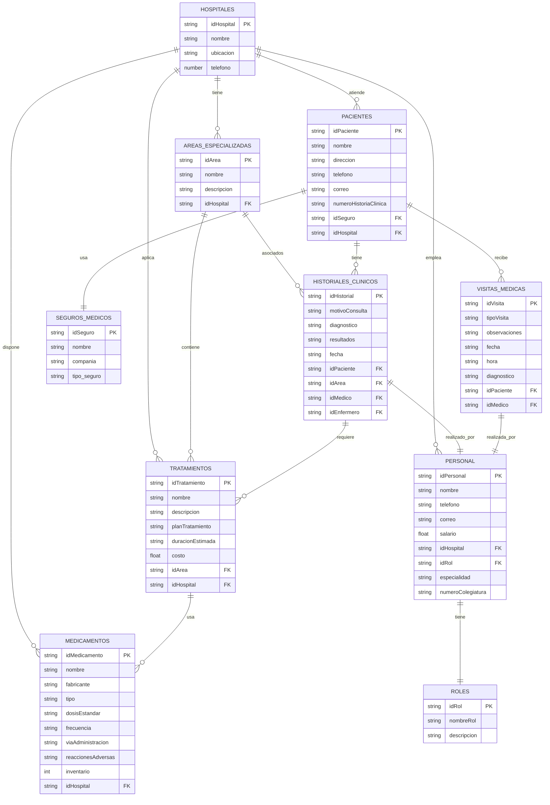
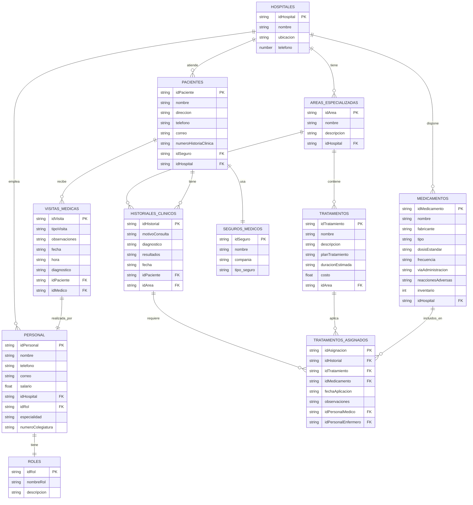

```mermaid

graph TD

  

%% Entidades principales

Hospitales[Hospitales]

Areas[AreasEspecializadas]

Pacientes[Pacientes]

Seguros[SegurosMedicos]

Historial[HistorialesClinicos]

Tratamientos[Tratamientos]

Medicamentos[Medicamentos]

Visitas[VisitasMedicas]

  

%% Personal dividido en roles

Directores[DirectoresGenerales]

Medicos[MedicosEspecialistas]

Enfermeros[PersonalEnfermeria]

Administrativos[PersonalAdministrativo]

Aseo[PersonalAseoYServicios]

  

%% Atributos Hospitales

idHospital((idHospital))

nombreHospital((nombre))

ubicacionHospital((ubicacion))

telefonoHospital((telefono))

Hospitales --> idHospital

Hospitales --> nombreHospital

Hospitales --> ubicacionHospital

Hospitales --> telefonoHospital

Hospitales -->|dirigido por| Directores

Hospitales -->|tiene áreas| Areas

Hospitales -->|tiene personal| Directores

Hospitales --> Directores

Hospitales --> Medicos

Hospitales --> Enfermeros

Hospitales --> Administrativos

Hospitales --> Aseo

Hospitales -->|atiende a| Pacientes

  

%% Areas Especializadas

idArea((idArea))

nombreArea((nombre))

descArea((descripcion))

Areas --> idArea

Areas --> nombreArea

Areas --> descArea

Areas -->|pertenece a| Hospitales

  

%% Personal General

Directores -->|trabaja en| Hospitales

Medicos -->|trabaja en| Hospitales

Enfermeros -->|trabaja en| Hospitales

Administrativos -->|trabaja en| Hospitales

Aseo -->|trabaja en| Hospitales

  

%% Pacientes

idPaciente((idPaciente))

nombrePaciente((nombre))

direccion((direccion))

telefono((telefono))

correo((correo))

historia((numeroHistoriaClinica))

Pacientes --> idPaciente

Pacientes --> nombrePaciente

Pacientes --> direccion

Pacientes --> telefono

Pacientes --> correo

Pacientes --> historia

Pacientes -->|tiene seguro| Seguros

Pacientes -->|tiene historial| Historial

Pacientes -->|hospitalizado en| Hospitales

  

%% Seguros Médicos

idSeguro((idSeguro))

nombreSeguro((nombre))

compania((compañia))

tipoSeguro((tipo_seguro))

Seguros --> idSeguro

Seguros --> nombreSeguro

Seguros --> compania

Seguros --> tipoSeguro

  

%% Historial Clínico

idHistorial((idHistorial))

motivo((MotivoConsulta))

diagnostico((diagnostico))

resultados((resultados))

fechaHistorial((fecha))

Historial --> idHistorial

Historial --> motivo

Historial --> diagnostico

Historial --> resultados

Historial --> fechaHistorial

Historial -->|de paciente| Pacientes

Historial -->|requiere tratamiento| Tratamientos

Historial -->|realizado por| Medicos

Historial -->|realizado por| Enfermeros

Historial -->|área médica| Areas

Historial -->|hospital| Hospitales

  

%% Tratamientos

idTratamiento((idTratamiento))

nombreTratamiento((nombre))

descripcionTratamiento((descripcion))

plan((PlanTratamiento))

duracion((duracion_estimada))

costo((costo))

Tratamientos --> idTratamiento

Tratamientos --> nombreTratamiento

Tratamientos --> descripcionTratamiento

Tratamientos --> plan

Tratamientos --> duracion

Tratamientos --> costo

Tratamientos -->|usa| Medicamentos

Tratamientos -->|área| Areas

Tratamientos -->|hospital| Hospitales

  

%% Medicamentos

idMed((idMedicamento))

nombreMed((nombre))

fabricante((fabricante))

tipoMed((tipo))

dosis((dosis_estandar))

frecuencia((Frecuencia))

via((VíaAdministración))

reacciones((ReaccionesAdversas))

inventario((inventario))

Medicamentos --> idMed

Medicamentos --> nombreMed

Medicamentos --> fabricante

Medicamentos --> tipoMed

Medicamentos --> dosis

Medicamentos --> frecuencia

Medicamentos --> via

Medicamentos --> reacciones

Medicamentos --> inventario

Medicamentos -->|disponible en| Hospitales

  

%% Visitas Médicas

idVisita((idVisita))

tipoVisita((tipo_visita))

observaciones((observaciones))

fechaVisita((fecha))

hora((hora))

diagnosticoVisita((diagnostico))

Visitas --> idVisita

Visitas --> tipoVisita

Visitas --> observaciones

Visitas --> fechaVisita

Visitas --> hora

Visitas --> diagnosticoVisita

Visitas -->|realizada por| Medicos

Visitas -->|atendió a| Pacientes

Visitas -->|hospital| Hospitales

```

# Sistema Hospitalario 

&nbsp;  
&nbsp;  
&nbsp;  
&nbsp;  
&nbsp;  

**DANIEL ESTEBAN GUERRERO QUINTERO**  
**AURA CAMILA PICO ARAQUE**

&nbsp;  
&nbsp;  
 
**S1**  
&nbsp;  
&nbsp;  
&nbsp;  

**PEDRO FELIPE GÓMEZ BONILLA**  

&nbsp;  
&nbsp;  
&nbsp;  

**CAMPUSLANDS**  
**ARTEMIS**  
**RUTA NODEJS**  
**BUCARAMANGA**  
**CAJASAN**
**2025**
 

 

#

 
 

## Tabla de Contenidos

- [Sistema Hospitalario](#sistema-hospitalario)
- 
  - [Tabla de Contenidos](#tabla-de-contenidos)
- [🏥 Sistema Hospitalario](#-sistema-hospitalario)
  - [Introducción](#introducción)
  - [📚 Caso de Estudio](#-caso-de-estudio)
- [📄 Planificación](#-planificación)
  - [🏗 Construcción del Modelo Conceptual](#-construcción-del-modelo-conceptual)
    - [Descripción](#descripción)
  - [📁 Estructura Modelo Conceptual](#-estructura-modelo-conceptual)
    - [1. 🏥 `hospitales`](#1--hospitales)
- 
    - [2. 🧠 `areasEspecializadas`](#2--areasespecializadas)
- 
    - [3. 🧠 `personal` (OPCIONAL )](#3--personal-opcional-)
      - [3.1 🏛️ `directoresGenerales`](#31-️-directoresgenerales)
      - [3.2 🩺 `medicosEspecialistas`](#32--medicosespecialistas)
      - [3.3 🩹 `personalEnfermeria`](#33--personalenfermeria)
      - [3.4.1 💼 `personalAdministrativo`](#341--personaladministrativo)
      - [3.5 🧹 `personalAseoYServicios`](#35--personalaseoyservicios)
- 
    - [4. 🧍 `pacientes`](#4--pacientes)
- 
    - [5. 💳 `segurosMedicos`](#5--segurosmedicos)
- 
    - [6. 📋 `historialesClinicos`](#6--historialesclinicos)
- 
    - [7. 💉 `tratamientos`](#7--tratamientos)
- 
    - [8. 💊 `medicamentos`](#8--medicamentos)
- 
    - [9. 📆 `visitasMedicas`](#9--visitasmedicas)
- [📈 Gráfica](#-gráfica)
    - [🛠️ Descripción Técnica](#️-descripción-técnica)
  - [🏗 Construcción del Modelo Lógico](#-construcción-del-modelo-lógico)
    - [Descripción](#descripción-1)
    - [📈 Gráfica](#-gráfica-1)
    - [Descripción Técnica](#descripción-técnica)
  - [〽 Normalización del Modelo Lógico](#-normalización-del-modelo-lógico)
    - [1️⃣ Primera Forma Normal (1FN)](#1️⃣-primera-forma-normal-1fn)
      - [Descripción](#descripción-2)
      - [📈 Gráfica](#-gráfica-2)
      - [Descripción Técnica](#descripción-técnica-1)
    - [2️⃣ Segunda Forma Normal (2FN)](#2️⃣-segunda-forma-normal-2fn)
      - [Descripción](#descripción-3)
      - [📈 Gráfica](#-gráfica-3)
      - [Descripción Técnica](#descripción-técnica-2)
    - [3️⃣ Tercera Forma Normal (3FN)](#3️⃣-tercera-forma-normal-3fn)
      - [Descripción](#descripción-4)
      - [📈 Gráfica](#-gráfica-4)
      - [Descripción Técnica](#descripción-técnica-3)
  - [🏗 Construcción del Modelo Físico](#-construcción-del-modelo-físico)
      - [Descripción](#descripción-5)
      - [📝**Código**](#código)
      - [Descripción Técnica](#descripción-técnica-4)
  - [📊 Diagrama E-R](#-diagrama-e-r)
        - [Descripción](#descripción-6)
        - [📈 Gráfica](#-gráfica-5)
        - [Descripción Técnica](#descripción-técnica-5)
  - [📐 Tablas](#-tablas)
        - [Descripción](#descripción-7)
      - [📈 Gráfica](#-gráfica-6)
        - [Descripción Técnica](#descripción-técnica-6)
  - [🔗📋 Relaciones entre Tablas](#-relaciones-entre-tablas)
        - [Descripción](#descripción-8)
        - [📈 Gráfica](#-gráfica-7)
        - [Descripción Técnica](#descripción-técnica-7)
  - [📋 Inserción de Datos](#-inserción-de-datos)
        - [Descripción](#descripción-9)
        - [📈 Gráfica](#-gráfica-8)
        - [Descripción Técnica](#descripción-técnica-8)
- [🔗 Referencias](#-referencias)
- 
  - [👥 Desarrolladores](#-desarrolladores)
  - [🛠 Herramientas de Desarrollo](#-herramientas-de-desarrollo)

 
 

#  🏥 Sistema Hospitalario 

El objetivo del proyecto es diseñar y desarrollar un sistema de base de datos en **MongoDB** que permita gestionar de manera eficiente todas las operaciones relacionadas con la administración de un **Sistema Hospitalario**. Dicho sistema incluirá la gestión de hospitales, pacientes, médicos, tratamientos, medicamentos, visitas médicas, historiales clínicos, áreas especializadas y personal administrativo.

## Introducción

El sistema propuesto busca facilitar la gestión de hospitales, pacientes, personal médico y administrativo, áreas especializadas, tratamientos, medicamentos, visitas médicas e historiales clínicos. Además, se incluirán mecanismos de autenticación y control de acceso basados en roles para garantizar la seguridad y privacidad de la información. A través de consultas optimizadas y funciones re utilizables, se pretende brindar a los usuarios herramientas para la toma de decisiones, el control de inventario, el análisis de datos clínicos y la mejora continua en la atención médica.

## 📚 Caso de Estudio

- [Recurso Base](https://drive.google.com/file/d/1MqFQ7nI6pOwNBHwOSZjvmbwOalD-9zoG/view)

En el entorno hospitalario actual, la gestión eficiente de la información médica es fundamental para garantizar la atención oportuna y precisa de los pacientes, muchos hospitales aún operan con registros físicos de sistemas fragmentados lo que genera demoras, la duplicación de datos y errores ya sean humanos.
    
Los hospital no cuenta con un sistema centralizado que permita almacenar consultar y actualizar la información de sus pacientes médicos tratamientos y personas administrativa de forma eficiente esto ha provocado dificultades en la gestión de historiales clínicos control de visitas médicas y distribución de medicamentos
    
Nuestra propuesta es un diseño e implementación de una base de datos No SQL , utilizando MongoDB , este nos permitirá gestionar de forma integral y escalable todos los elementos relacionados con las operaciones hospitalarias
    
Tendremos en cuenta la gestión de las siguientes entidades que serán claves:

- **Hospitales**: Información general de cada sede.
- **Pacientes**: Datos personales, hospital asignado, historial clínico, visitas médicas.
- **Médicos**: Especialidades, hospital asignado, pacientes atendidos.
- **Visitas Médicas**: Registro de consultas, fecha, diagnóstico y médico tratante.
- **Tratamientos y Medicamentos**: Información de los tratamientos indicados y medicamentos administrados.
- **Áreas Especializadas**: Departamento o servicio específico del hospital.
- **Personal Administrativo**: Encargados de la gestión hospitalaria.
- **Historiales Clínicos**: Evolución médica del paciente, vinculada a visitas y tratamientos.

Usaremos MongoDB ya que nos permite almacenar datos de manera flexible lo que es ideal para manejar documentos clínicos que pueden variar en estructuras según el paciente o especialidad , además de su capacidad de escalabilidad en sistemas hospitalarios que pueden crecer con el tiempo.

# 📄 Planificación

La planificación del proyecto se ha estructurado en **etapas progresivas**, con base en el análisis de requerimientos del sistema hospitalario, su estructura funcional y los datos que se deben gestionar. El objetivo es lograr una base de datos No SQL eficiente, escalable y coherente con el funcionamiento real de una institución médica.

Siguiendo la construcción del sistema hospitalario en MongoDB requiere una planificación estructurada que permita abordar cada componente de manera lógica, modular y escalable. Esta planificación se diseñó con base en las necesidades específicas de un entorno clínico real, considerando tanto la complejidad de la información como la dinámica entre las áreas, el personal y los pacientes.

Para finalizar la planificación del sistema hospitalario la basamos en etapas progresivas en la cual abordamos cada componente de manera lógica, modular y escalable. Diseñado a partir de una base de las necesidades específicas de un entorno clínico real , considerando tanto la complejidad de la información como la dinámica que tiene cada área, el personal y sus pacientes.

 

## 🏗 Construcción del Modelo Conceptual

Durante la construcción del modelo conceptual, nuestro objetivo principal fue estructurar una base de datos que no solo cumpliera con los requerimientos técnicos de un sistema hospitalario moderno, sino que también representara con fidelidad el funcionamiento real de una institución médica. 
Desde el inicio, nos propusimos que cada colección reflejara relaciones reales entre pacientes, médicos, personal administrativo, tratamientos, medicamentos y espacios físicos, manteniendo siempre la coherencia, escalabilidad y eficiencia en la gestión de la información.

 

### Descripción

Para diseñar el modelo, partimos de entidades fundamentales como hospitales, las cuales actúan como eje central del sistema. Cada hospital se encuentra relacionado directamente con sus áreas especializadas, su personal (médico, administrativo, de enfermería, directivo y de servicios), así como con los pacientes que atiende. A partir de esta estructura, definimos otras entidades como pacientes, visitas médicas, historiales clínicos, tratamientos y medicamentos, todas enlazadas mediante referencias claras que permiten trazar un recorrido completo de atención dentro del sistema. 

Un aspecto clave fue unificar la gestión del personal en una sola colección (personal), subdividido lógicamente por roles, lo cual nos permitió reducir redundancias y facilitar las consultas posteriores. Asimismo, modelamos los seguros médicos como documentos referenciados que amplían la información del paciente sin sobrecargar su estructura. 

Las relaciones entre especialidades, tratamientos y medicamentos también fueron cuidadosamente mapeadas para garantizar una segmentación lógica y detallada que permita analizar la operación del hospital por áreas médicas. Este diseño se realizó considerando la integración fluida de todos los componentes y dejando la estructura lista para escalar e integrar nuevas funcionalidades.

 

  
<strong> Estructura del seguimiento a hacer para nuestro modelo conceptual </strong>

  
## 📁 Estructura Modelo Conceptual

### 1. 🏥 `hospitales`

Representa los hospitales del sistema.

-   `idHospital`: ObjectId (PK) – Identificador único del hospital
    
-   `nombre`: String – Nombre del hospital
    
-   `ubicacion`: String – Dirección o ciudad
    
-   `telefono`: String – Número de contacto
    
-   `idDirector`: Ref → `personal` – Hace referencia al director general (tipo 001)
    
-   `areasEspecializadas`: [Ref → `areasEspecializadas`] – Áreas que conforman el hospital
    
-   `personal`: [Ref → `personal`] – Médicos, administrativos, enfermeros y otros
    
-   `pacientes`: [Ref → `pacientes`] – Pacientes registrados en el hospital
    
#

### 2. 🧠 `areasEspecializadas`

Define las especialidades médicas disponibles.

-   `idArea`: ObjectId (PK) – Identificador único del área

-   `nombre`: String – Nombre del área (ej. Cardiología, Pediatría)
    
-   `descripcion`: String – Descripción general del área

- `hospital_asignado`:  Ref → hospitales *(Requerido)*  
#
    
### 3. 🧠 `personal` (OPCIONAL )
Unificar los cargos en una sola colección para en un momento de consultas sean simples y minimizar la duplicación de estructura entre colecciones al igual que validaciones mas simples 👍

#### 3.1 🏛️ `directoresGenerales`

Estructura ampliada de directores generales con todos los campos.

- `idDirector`: ObjectId *(Primary Key)*  
- `tipo_personal`: String *(Requerido)*  
- `numero_documento`: String *(Requerido)*  
- `nombre_completo`: String *(Requerido)*  
- `rol`: String *(Requerido)*  
- `telefono`: String *(Requerido)*  
- `correo_electronico`: String *(Requerido)*  
- `salario`: Number *(Requerido)*  
- `fecha_ingreso`: Date *(Requerido)*  
- `hospitales_asignados`: Ref → hospitales*(Requerido)*  

---

#### 3.2 🩺 `medicosEspecialistas`

- `idMedico`: ObjectId *(Primary Key)*  
- `tipo_personal`: String *(Requerido)*  
- `numero_colegiatura`: String *(Requerido)*  
- `nombre_completo`: String *(Requerido)*  
- `especialidad`: String *(Requerido)*  
- `telefono`: String *(Requerido)*  
- `correo_electronico`: String *(Requerido)*  
- `salario`: Number *(Requerido)*  
- `hospital_asignado`: Ref → hospitales *(Requerido)*  
---

#### 3.3 🩹 `personalEnfermeria`

- `idEnfermero`: ObjectId *(Primary Key)*  
- `tipo_personal`: String *(Requerido)*  
- `numero_documento`: String *(Requerido)*  
- `nombre_completo`: String *(Requerido)*  
- `area_asignada`: String *(Requerido)*  
- `telefono`: String *(Requerido)*  
- `correo_electronico`: String *(Requerido)*  
- `salario`: Number *(Requerido)*  
- `hospital_asignado`: Ref → hospitales *(Requerido)*  
---

#### 3.4.1 💼 `personalAdministrativo`

Estructura del personal administrativo del sistema hospitalario.

- `idAdministrativo`: ObjectId *(Primary Key)*  
- `tipo_personal`: String *(Requerido)*  
- `numero_documento`: String *(Requerido)*  
- `nombre_completo`: String *(Requerido)*  
- `cargo`: String *(Requerido)*  
 [
    - `"Asistente de Gestión Humana"`  
    - `"Coordinador Financiero"`  
    - `"Recepcionista Principal"`
  ]
- `telefono`: String *(Requerido)*  
- `correo_electronico`: String *(Requerido)*  
- `salario`: Number *(Requerido)*  
- `hospital_asignado`: Ref → hospitales*(Requerido)*  
---

#### 3.5 🧹 `personalAseoYServicios`

Estructura del personal de aseo y servicios generales.

- `idPersonalAseo`: ObjectId *(Primary Key)* 
- `tipo_personal`: String *(Requerido)*  
- `numero_documento`: String *(Requerido)*  
  - Documento de identidad (10 dígitos).  
- `nombre_completo`: String *(Requerido)*  
  - Nombre completo del empleado.  
- `funcion`: String *(Requerido)*  
  - Descripción específica de sus labores.  [
    - `"Limpieza de áreas quirúrgicas"`  
    - `"Aseo de habitaciones"`  
    - `"Mantenimiento de áreas comunes"`
]
- `telefono`: String *(Requerido)*   
- `correo_electronico`: String *(Opcional)*  
- `salario`: Number *(Requerido)*  
- `hospital_asignado`:  Ref → hospitales *(Requerido)*  
    
#
### 4. 🧍 `pacientes`

Información de los pacientes registrados.

-   `idPaciente`: ObjectId (PK)
      
-   `numeroHistoriaClinica`: String – Código único
    
-   `nombre`: String
    
-   `direccion`: String
    
-   `telefono`: String
    
-   `correo`: String
    
-   `segurosMedicos`: [Ref → `segurosMedicos` :  `nombre`: String , `compañia`: String  ]
    
-   `historialClinico`: [Ref → `historialesClinicos`: -   `idPaciente`: Ref →[ `pacientes`] , `diagnostico`: String ,	`tratamientos`: [Ref → 	`tratamientos`]	,`resultados`: String`fecha`: Date ]

- `hospital_asignado`:  Ref → hospitales *(Requerido)*  

#
### 5. 💳 `segurosMedicos`

Listado de aseguradoras y entidades médicas.

-   `idSeguro`: ObjectId (PK)
    
-   `nombre`: String
    
-   `compañia`: String (opcional)

-    `tipo_seguro` :  String 
    

#
### 6. 📋 `historialesClinicos`

Registro médico del paciente.

-   `idHistorial`: ObjectId (PK)
    
-   `idPaciente`: Ref → `pacientes`
 	
-   `tipo de especialista`:  Ref → `areasEspecializadas` :  String
 	
-    `médico_responsable` :  Ref → `idMedico , idEnfermero `
 	    
-    `Motivo de la consulta` :    *String (Requerido)*

-   `diagnostico`: String
    
-   `tratamientos`: [Ref → `tratamientos`]
    
-   `resultados`: String
    
-   `fecha`: Date
    
- `hospital_asignado`:  Ref → hospitales *(Requerido)*  

#
### 7. 💉 `tratamientos`

Procedimientos realizados al paciente.

-   `idTratamiento`: ObjectId (PK)
    
-   `nombre`: String
    
-   `descripcion`: String
    
-   `areaMedica`: Ref → `areasEspecializadas`

-    `Plan de tratamiento` : String

-    `duracion_estimada` :  String
    
-   `costo`: Number
    
-   `medicamentosUsados`: [Ref → `medicamentos`]

- `hospital_asignado`:  Ref → hospitales *(Requerido)*  
    
#
### 8. 💊 `medicamentos`

Inventario de medicamentos disponibles.

-   `idMedicamento`: ObjectId (PK)
    
-   `nombre`: String
    
-   `fabricante`: String
    
-   `tipo`: String (ej. analgésico, antibiótico)

-    `dosis_estandar` :  String  (Requerido)

-   `Frecuencia` :   String  (Requerido)

-   `Vía de administración`  :    String  (Requerido)

-   `Reacciones adversas` :    String  (Requerido)
    
-   `inventario`: Number
    
- `hospital_asignado`:  Ref → hospitales *(Requerido)*  
- 
#

### 9. 📆 `visitasMedicas`

Registro de las atenciones médicas.

-   `idVisita`: ObjectId (PK)
    
-   `tipo_visita` :  String  (Requerido)

-	 `observaciones` :   String  (Requerido)

-   `fecha`: Date
    
-   `hora`: String
    
-   `medicoAsignado`: Ref → `personal` (tipo 002)
    
-   `pacienteAtendido`: Ref → `pacientes`
    
-   `diagnostico`: String

- `hospital_asignado`:  Ref → hospitales *(Requerido)*  

Analizar quienes tendran el `permisos: ["ver_pacientes", "editar_visitas"]`   para modelar los roles y el acceso de un array de permisos
  
(OPCIONAL):
tener en cuenta implementar o no **Citas y turnos** (gestión de tiempos)  , **Inventario y facturación** (gestión operativa y financiera) , Consentimientos, Reportes, Alertas, Adjuntos, Encuestas  

# 📈 Gráfica

 

### 🛠️ Descripción Técnica

Técnicamente, el modelo conceptual fue construido con un enfoque modular, usando `ObjectId` como identificadores únicos y referencias entre documentos para mantener la integridad referencial. Se aplicó el principio de reutilización a través de arrays referenciales en campos como hospital_asignado, medicamentosUsados, historialClinico o areasEspecializadas, lo que permite mantener un alto nivel de normalización sin sacrificar el rendimiento. 

Se emplearon estructuras anidadas en contextos donde era más eficiente agrupar datos directamente, como los formularios clínicos del historial o los planes de tratamiento, evitando consultas innecesarias. La clasificación del personal dentro de una colección común con discriminación por tipo de rol facilita la validación y el control de accesos, mientras que el uso de relaciones bidireccionales entre visitas, médicos y pacientes permite reconstruir trayectorias clínicas completas. 

Este modelo conceptual, respaldado por una gráfica ER coherente, establece las bases técnicas para avanzar hacia el modelo lógico y físico sin necesidad de rediseñar las relaciones principales, y garantiza un manejo robusto y flexible de la información médica, administrativa y operativa del sistema hospitalario.

 

## 🏗 Construcción del Modelo Lógico

 

### Descripción

 

### 📈 Gráfica
 

### Descripción Técnica

 
 

## 〽 Normalización del Modelo Lógico

  

### 1️⃣ Primera Forma Normal (1FN)

#### Descripción

#### 📈 Gráfica

#### Descripción Técnica

 
### 2️⃣ Segunda Forma Normal (2FN)

#### Descripción

#### 📈 Gráfica

#### Descripción Técnica

### 3️⃣ Tercera Forma Normal (3FN)

#### Descripción

#### 📈 Gráfica

#### Descripción Técnica

  

## 🏗 Construcción del Modelo Físico

#### Descripción

#### 📝**Código**

#### Descripción Técnica

 

## 📊 Diagrama E-R

  
##### Descripción

##### 📈 Gráfica

##### Descripción Técnica

## 📐 Tablas

##### Descripción

#### 📈 Gráfica

##### Descripción Técnica

## 🔗📋 Relaciones entre Tablas

##### Descripción

##### 📈 Gráfica

##### Descripción Técnica

## 📋 Inserción de Datos

##### Descripción

##### 📈 Gráfica

##### Descripción Técnica

# 🔗 Referencias

- [ Sistema de Información Hospitalaria](https://www.sciencedirect.com/topics/computer-science/hospital-information-system)

- [sistema de gestión hospitalaria](https://www.aalpha.net/blog/how-to-build-a-hospital-management-system/)

#
 

## 👥 Desarrolladores

- [@Danny200523](https://github.com/Danny200523)
- [@AuraCamilaPicoAraque](https://github.com/AuraCamilaPicoAraque)

 

## 🛠 Herramientas de Desarrollo

  

<h3 align="left"> MongoDB ~ </h3> 

