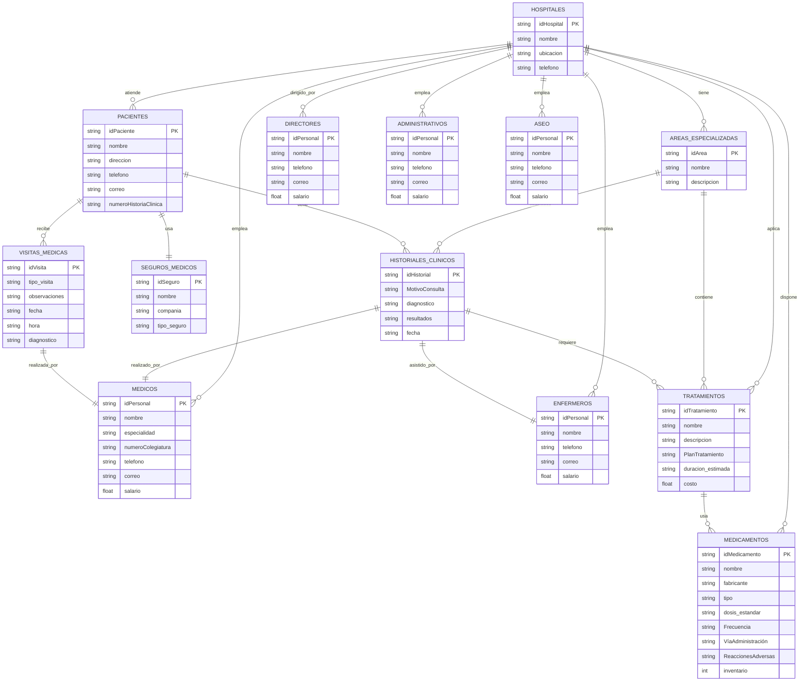
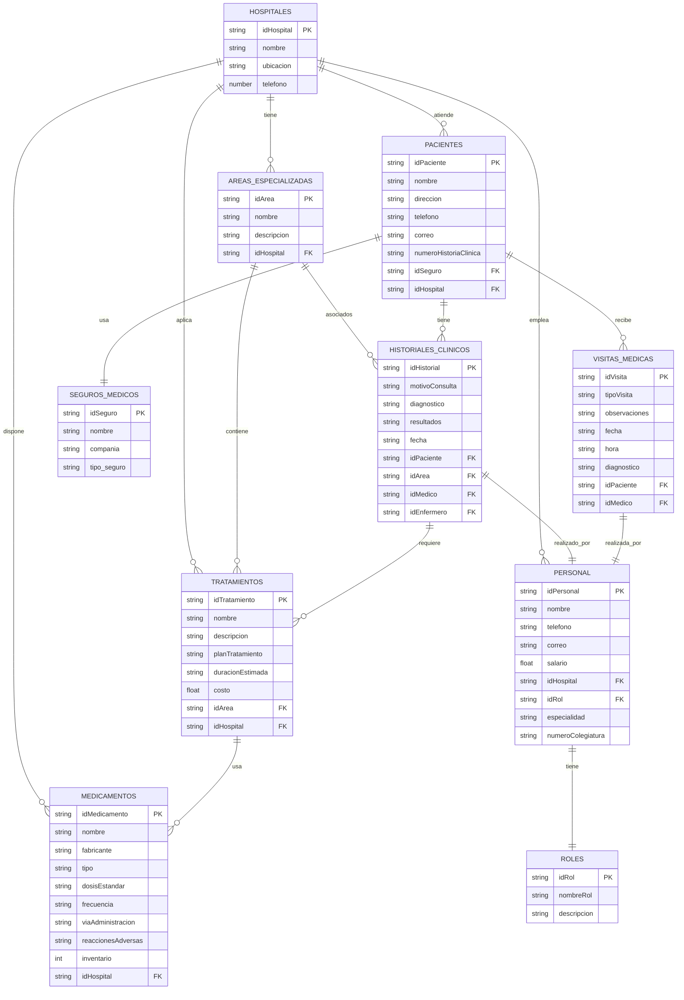
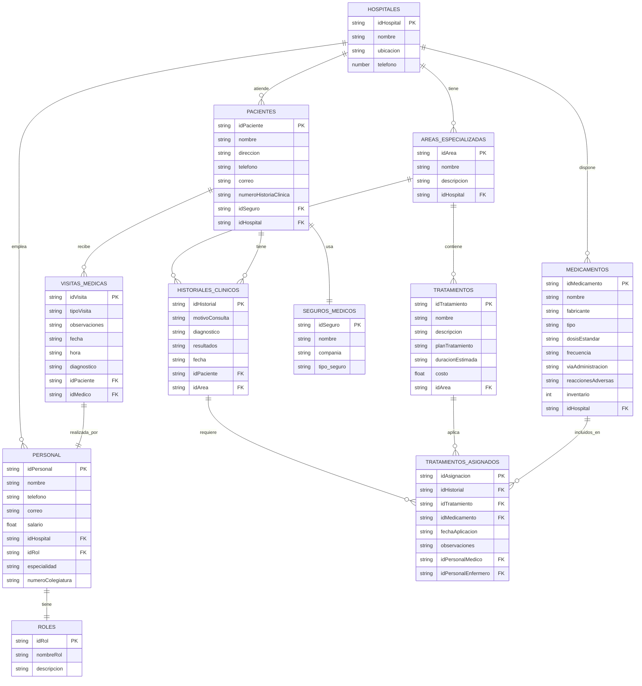
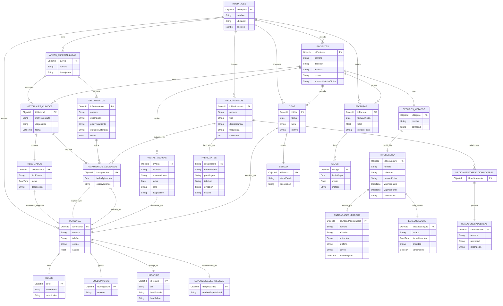

```mermaid

graph TD

  

%% Entidades principales

Hospitales[Hospitales]

Areas[AreasEspecializadas]

Pacientes[Pacientes]

Seguros[SegurosMedicos]

Historial[HistorialesClinicos]

Tratamientos[Tratamientos]

Medicamentos[Medicamentos]

Visitas[VisitasMedicas]

  

%% Personal dividido en roles

Directores[DirectoresGenerales]

Medicos[MedicosEspecialistas]

Enfermeros[PersonalEnfermeria]

Administrativos[PersonalAdministrativo]

Aseo[PersonalAseoYServicios]

  

%% Atributos Hospitales

idHospital((idHospital))

nombreHospital((nombre))

ubicacionHospital((ubicacion))

telefonoHospital((telefono))

Hospitales --> idHospital

Hospitales --> nombreHospital

Hospitales --> ubicacionHospital

Hospitales --> telefonoHospital

Hospitales -->|dirigido por| Directores

Hospitales -->|tiene áreas| Areas

Hospitales -->|tiene personal| Directores

Hospitales --> Directores

Hospitales --> Medicos

Hospitales --> Enfermeros

Hospitales --> Administrativos

Hospitales --> Aseo

Hospitales -->|atiende a| Pacientes

  

%% Areas Especializadas

idArea((idArea))

nombreArea((nombre))

descArea((descripcion))

Areas --> idArea

Areas --> nombreArea

Areas --> descArea

Areas -->|pertenece a| Hospitales

  

%% Personal General

Directores -->|trabaja en| Hospitales

Medicos -->|trabaja en| Hospitales

Enfermeros -->|trabaja en| Hospitales

Administrativos -->|trabaja en| Hospitales

Aseo -->|trabaja en| Hospitales

  

%% Pacientes

idPaciente((idPaciente))

nombrePaciente((nombre))

direccion((direccion))

telefono((telefono))

correo((correo))

historia((numeroHistoriaClinica))

Pacientes --> idPaciente

Pacientes --> nombrePaciente

Pacientes --> direccion

Pacientes --> telefono

Pacientes --> correo

Pacientes --> historia

Pacientes -->|tiene seguro| Seguros

Pacientes -->|tiene historial| Historial

Pacientes -->|hospitalizado en| Hospitales

  

%% Seguros Médicos

idSeguro((idSeguro))

nombreSeguro((nombre))

compania((compañia))

tipoSeguro((tipo_seguro))

Seguros --> idSeguro

Seguros --> nombreSeguro

Seguros --> compania

Seguros --> tipoSeguro

  

%% Historial Clínico

idHistorial((idHistorial))

motivo((MotivoConsulta))

diagnostico((diagnostico))

resultados((resultados))

fechaHistorial((fecha))

Historial --> idHistorial

Historial --> motivo

Historial --> diagnostico

Historial --> resultados

Historial --> fechaHistorial

Historial -->|de paciente| Pacientes

Historial -->|requiere tratamiento| Tratamientos

Historial -->|realizado por| Medicos

Historial -->|realizado por| Enfermeros

Historial -->|área médica| Areas

Historial -->|hospital| Hospitales

  

%% Tratamientos

idTratamiento((idTratamiento))

nombreTratamiento((nombre))

descripcionTratamiento((descripcion))

plan((PlanTratamiento))

duracion((duracion_estimada))

costo((costo))

Tratamientos --> idTratamiento

Tratamientos --> nombreTratamiento

Tratamientos --> descripcionTratamiento

Tratamientos --> plan

Tratamientos --> duracion

Tratamientos --> costo

Tratamientos -->|usa| Medicamentos

Tratamientos -->|área| Areas

Tratamientos -->|hospital| Hospitales

  

%% Medicamentos

idMed((idMedicamento))

nombreMed((nombre))

fabricante((fabricante))

tipoMed((tipo))

dosis((dosis_estandar))

frecuencia((Frecuencia))

via((VíaAdministración))

reacciones((ReaccionesAdversas))

inventario((inventario))

Medicamentos --> idMed

Medicamentos --> nombreMed

Medicamentos --> fabricante

Medicamentos --> tipoMed

Medicamentos --> dosis

Medicamentos --> frecuencia

Medicamentos --> via

Medicamentos --> reacciones

Medicamentos --> inventario

Medicamentos -->|disponible en| Hospitales

  

%% Visitas Médicas

idVisita((idVisita))

tipoVisita((tipo_visita))

observaciones((observaciones))

fechaVisita((fecha))

hora((hora))

diagnosticoVisita((diagnostico))

Visitas --> idVisita

Visitas --> tipoVisita

Visitas --> observaciones

Visitas --> fechaVisita

Visitas --> hora

Visitas --> diagnosticoVisita

Visitas -->|realizada por| Medicos

Visitas -->|atendió a| Pacientes

Visitas -->|hospital| Hospitales

```

# Sistema Hospitalario 

&nbsp;  
&nbsp;  
&nbsp;  
&nbsp;  
&nbsp;  

**DANIEL ESTEBAN GUERRERO QUINTERO**  
**AURA CAMILA PICO ARAQUE**

&nbsp;  
&nbsp;  
 
**S1**  
&nbsp;  
&nbsp;  
&nbsp;  

**PEDRO FELIPE GÓMEZ BONILLA**  

&nbsp;  
&nbsp;  
&nbsp;  

**CAMPUSLANDS**  
**ARTEMIS**  
**RUTA NODEJS**  
**BUCARAMANGA**  
**CAJASAN**
**2025**
 

 

#

 
 

## Tabla de Contenidos

- [Sistema Hospitalario](#sistema-hospitalario)
- 
  - [Tabla de Contenidos](#tabla-de-contenidos)
- [🏥 Sistema Hospitalario](#-sistema-hospitalario)
  - [Introducción](#introducción)
  - [📚 Caso de Estudio](#-caso-de-estudio)
- [📄 Planificación](#-planificación)
  - [🏗 Construcción del Modelo Conceptual](#-construcción-del-modelo-conceptual)
    - [Descripción](#descripción)
  - [📁 Estructura Modelo Conceptual](#-estructura-modelo-conceptual)
    - [1. 🏥 `hospitales`](#1--hospitales)
- 
    - [2. 🧠 `areasEspecializadas`](#2--areasespecializadas)
- 
    - [3. 🧠 `personal` (OPCIONAL )](#3--personal-opcional-)
      - [3.1 🏛️ `directoresGenerales`](#31-️-directoresgenerales)
      - [3.2 🩺 `medicosEspecialistas`](#32--medicosespecialistas)
      - [3.3 🩹 `personalEnfermeria`](#33--personalenfermeria)
      - [3.4.1 💼 `personalAdministrativo`](#341--personaladministrativo)
      - [3.5 🧹 `personalAseoYServicios`](#35--personalaseoyservicios)
- 
    - [4. 🧍 `pacientes`](#4--pacientes)
- 
    - [5. 💳 `segurosMedicos`](#5--segurosmedicos)
- 
    - [6. 📋 `historialesClinicos`](#6--historialesclinicos)
- 
    - [7. 💉 `tratamientos`](#7--tratamientos)
- 
    - [8. 💊 `medicamentos`](#8--medicamentos)
- 
    - [9. 📆 `visitasMedicas`](#9--visitasmedicas)
  - [📈 Gráfica](#-gráfica)
    - [🛠️ Descripción Técnica](#️-descripción-técnica)
  - [🏗 Construcción del Modelo Lógico](#-construcción-del-modelo-lógico)
    - [Descripción](#descripción-1)
  - [📈 Gráfica](#-gráfica-1)
    - [Descripción Técnica](#descripción-técnica)
  - [〽 Normalización del Modelo Lógico](#-normalización-del-modelo-lógico)
    - [1️⃣ Primera Forma Normal (1FN)](#1️⃣-primera-forma-normal-1fn)
      - [Descripción](#descripción-2)
  - [📈 Gráfica](#-gráfica-2)
      - [Descripción Técnica](#descripción-técnica-1)
    - [2️⃣ Segunda Forma Normal (2FN)](#2️⃣-segunda-forma-normal-2fn)
      - [Descripción](#descripción-3)
  - [📈 Gráfica](#-gráfica-3)
      - [Descripción Técnica](#descripción-técnica-2)
    - [3️⃣ Tercera Forma Normal (3FN)](#3️⃣-tercera-forma-normal-3fn)
      - [Descripción](#descripción-4)
  - [📈 Gráfica](#-gráfica-4)
      - [Descripción Técnica](#descripción-técnica-3)
  - [🏗 Construcción del Modelo Físico](#-construcción-del-modelo-físico)
      - [Descripción](#descripción-5)
      - [📝**Código**](#código)
      - [Descripción Técnica](#descripción-técnica-4)
  - [📊 Diagrama E-R](#-diagrama-e-r)
        - [Descripción](#descripción-6)
  - [📈 Gráfica](#-gráfica-5)
        - [Descripción Técnica](#descripción-técnica-5)
  - [📐 Tablas](#-tablas)
        - [Descripción](#descripción-7)
  - [📈 Gráfica](#-gráfica-6)
        - [Descripción Técnica](#descripción-técnica-6)
  - [🔗📋 Relaciones entre Tablas](#-relaciones-entre-tablas)
        - [Descripción](#descripción-8)
  - [📈 Gráfica](#-gráfica-7)
        - [Descripción Técnica](#descripción-técnica-7)
  - [📋 Inserción de Datos](#-inserción-de-datos)
        - [Descripción](#descripción-9)
  - [📈 Gráfica](#-gráfica-8)
        - [Descripción Técnica](#descripción-técnica-8)
- [🔗 Referencias](#-referencias)
- 
  - [👥 Desarrolladores](#-desarrolladores)
  - [🛠 Herramientas de Desarrollo](#-herramientas-de-desarrollo)

 
 

## ✅ Requisitos del Sistema

Para el desarrollo de nuestro **Sistema Hospitalario en MongoDB**, nosotros utilizamos el siguiente entorno tecnológico:

- **MongoDB** `v6.0` o superior  
  Es el motor de base de datos NoSQL que elegimos para estructurar y almacenar toda la información hospitalaria, permitiéndonos trabajar con colecciones flexibles y relaciones referenciales.

- **MongoDB Compass** `v1.40` o superior  
  Esta herramienta nos facilitó la visualización y validación de nuestras colecciones, así como la ejecución de consultas y operaciones CRUD durante el proceso de pruebas.

- **Node.js** `v18.x` o superior *(opcional)*  
  Lo consideramos útil para crear scripts que automatizan la carga de datos y simulan interacciones con la base de datos desde una lógica de backend.

- **Visual Studio Code**  
  Fue nuestro editor de código principal. Nos permitió mantener una estructura organizada del proyecto y colaborar de manera eficiente.

> 🛠️ Recomendamos verificar que el servicio de MongoDB esté corriendo correctamente en el entorno local antes de iniciar con las inserciones o consultas.

 
 

#  🏥 Sistema Hospitalario 

El objetivo del proyecto es diseñar y desarrollar un sistema de base de datos en **MongoDB** que permita gestionar de manera eficiente todas las operaciones relacionadas con la administración de un **Sistema Hospitalario**. Dicho sistema incluirá la gestión de hospitales, pacientes, médicos, tratamientos, medicamentos, visitas médicas, historiales clínicos, áreas especializadas y personal administrativo.

 

## Introducción

El sistema propuesto busca facilitar la gestión de hospitales, pacientes, personal médico y administrativo, áreas especializadas, tratamientos, medicamentos, visitas médicas e historiales clínicos. Además, se incluirán mecanismos de autenticación y control de acceso basados en roles para garantizar la seguridad y privacidad de la información. A través de consultas optimizadas y funciones re utilizables, se pretende brindar a los usuarios herramientas para la toma de decisiones, el control de inventario, el análisis de datos clínicos y la mejora continua en la atención médica.

  

## 📚 Caso de Estudio

- [Recurso Base](https://drive.google.com/file/d/1MqFQ7nI6pOwNBHwOSZjvmbwOalD-9zoG/view)

En el entorno hospitalario actual, la gestión eficiente de la información médica es fundamental para garantizar la atención oportuna y precisa de los pacientes, muchos hospitales aún operan con registros físicos de sistemas fragmentados lo que genera demoras, la duplicación de datos y errores ya sean humanos.
    
Los hospital no cuenta con un sistema centralizado que permita almacenar consultar y actualizar la información de sus pacientes médicos tratamientos y personas administrativa de forma eficiente esto ha provocado dificultades en la gestión de historiales clínicos control de visitas médicas y distribución de medicamentos
    
Nuestra propuesta es un diseño e implementación de una base de datos No SQL , utilizando MongoDB , este nos permitirá gestionar de forma integral y escalable todos los elementos relacionados con las operaciones hospitalarias
    
Tendremos en cuenta la gestión de las siguientes entidades que serán claves:

- **Hospitales**: Información general de cada sede.
- **Pacientes**: Datos personales, hospital asignado, historial clínico, visitas médicas.
- **Médicos**: Especialidades, hospital asignado, pacientes atendidos.
- **Visitas Médicas**: Registro de consultas, fecha, diagnóstico y médico tratante.
- **Tratamientos y Medicamentos**: Información de los tratamientos indicados y medicamentos administrados.
- **Áreas Especializadas**: Departamento o servicio específico del hospital.
- **Personal Administrativo**: Encargados de la gestión hospitalaria.
- **Historiales Clínicos**: Evolución médica del paciente, vinculada a visitas y tratamientos.

Usaremos MongoDB ya que nos permite almacenar datos de manera flexible lo que es ideal para manejar documentos clínicos que pueden variar en estructuras según el paciente o especialidad , además de su capacidad de escalabilidad en sistemas hospitalarios que pueden crecer con el tiempo.

  

# 📄 Planificación

La planificación del proyecto se ha estructurado en **etapas progresivas**, con base en el análisis de requerimientos del sistema hospitalario, su estructura funcional y los datos que se deben gestionar. El objetivo es lograr una base de datos No SQL eficiente, escalable y coherente con el funcionamiento real de una institución médica.

Siguiendo la construcción del sistema hospitalario en MongoDB requiere una planificación estructurada que permita abordar cada componente de manera lógica, modular y escalable. Esta planificación se diseñó con base en las necesidades específicas de un entorno clínico real, considerando tanto la complejidad de la información como la dinámica entre las áreas, el personal y los pacientes.

Para finalizar la planificación del sistema hospitalario la basamos en etapas progresivas en la cual abordamos cada componente de manera lógica, modular y escalable. Diseñado a partir de una base de las necesidades específicas de un entorno clínico real , considerando tanto la complejidad de la información como la dinámica que tiene cada área, el personal y sus pacientes.

 

## 🏗 Construcción del Modelo Conceptual

Durante la construcción del modelo conceptual, nuestro objetivo principal fue estructurar una base de datos que no solo cumpliera con los requerimientos técnicos de un sistema hospitalario moderno, sino que también representara con fidelidad el funcionamiento real de una institución médica. 
Desde el inicio, nos propusimos que cada colección reflejara relaciones reales entre pacientes, médicos, personal administrativo, tratamientos, medicamentos y espacios físicos, manteniendo siempre la coherencia, escalabilidad y eficiencia en la gestión de la información.

 

### Descripción

Para diseñar el modelo, partimos de entidades fundamentales como hospitales, las cuales actúan como eje central del sistema. Cada hospital se encuentra relacionado directamente con sus áreas especializadas, su personal (médico, administrativo, de enfermería, directivo y de servicios), así como con los pacientes que atiende. A partir de esta estructura, definimos otras entidades como pacientes, visitas médicas, historiales clínicos, tratamientos y medicamentos, todas enlazadas mediante referencias claras que permiten trazar un recorrido completo de atención dentro del sistema. 

Un aspecto clave fue unificar la gestión del personal en una sola colección (personal), subdividido lógicamente por roles, lo cual nos permitió reducir redundancias y facilitar las consultas posteriores. Asimismo, modelamos los seguros médicos como documentos referenciados que amplían la información del paciente sin sobrecargar su estructura. 

Las relaciones entre especialidades, tratamientos y medicamentos también fueron cuidadosamente mapeadas para garantizar una segmentación lógica y detallada que permita analizar la operación del hospital por áreas médicas. Este diseño se realizó considerando la integración fluida de todos los componentes y dejando la estructura lista para escalar e integrar nuevas funcionalidades.

 

  
<strong> 🧰 Estructura del seguimiento a hacer para nuestro modelo conceptual </strong>

  
## 📁 Estructura Modelo Conceptual

### 1. 🏥 `hospitales`

Representa los hospitales del sistema.

-   `idHospital`: ObjectId (PK) – Identificador único del hospital
    
-   `nombre`: String – Nombre del hospital
    
-   `ubicacion`: String – Dirección o ciudad
    
-   `telefono`: String – Número de contacto
    
-   `idDirector`: Ref → `personal` – Hace referencia al director general (tipo 001)
    
-   `areasEspecializadas`: [Ref → `areasEspecializadas`] – Áreas que conforman el hospital
    
-   `personal`: [Ref → `personal`] – Médicos, administrativos, enfermeros y otros
    
-   `pacientes`: [Ref → `pacientes`] – Pacientes registrados en el hospital
    
#

### 2. 🧠 `areasEspecializadas`

Define las especialidades médicas disponibles.

-   `idArea`: ObjectId (PK) – Identificador único del área

-   `nombre`: String – Nombre del área (ej. Cardiología, Pediatría)
    
-   `descripcion`: String – Descripción general del área

- `hospital_asignado`:  Ref → hospitales *(Requerido)*  
#
    
### 3. 🧠 `personal` (OPCIONAL )
Unificar los cargos en una sola colección para en un momento de consultas sean simples y minimizar la duplicación de estructura entre colecciones al igual que validaciones mas simples 👍

#### 3.1 🏛️ `directoresGenerales`

Estructura ampliada de directores generales con todos los campos.

- `idDirector`: ObjectId *(Primary Key)*  
- `tipo_personal`: String *(Requerido)*  
- `numero_documento`: String *(Requerido)*  
- `nombre_completo`: String *(Requerido)*  
- `rol`: String *(Requerido)*  
- `telefono`: String *(Requerido)*  
- `correo_electronico`: String *(Requerido)*  
- `salario`: Number *(Requerido)*  
- `fecha_ingreso`: Date *(Requerido)*  
- `hospitales_asignados`: Ref → hospitales*(Requerido)*  

---

#### 3.2 🩺 `medicosEspecialistas`

- `idMedico`: ObjectId *(Primary Key)*  
- `tipo_personal`: String *(Requerido)*  
- `numero_colegiatura`: String *(Requerido)*  
- `nombre_completo`: String *(Requerido)*  
- `especialidad`: String *(Requerido)*  
- `telefono`: String *(Requerido)*  
- `correo_electronico`: String *(Requerido)*  
- `salario`: Number *(Requerido)*  
- `hospital_asignado`: Ref → hospitales *(Requerido)*  
---

#### 3.3 🩹 `personalEnfermeria`

- `idEnfermero`: ObjectId *(Primary Key)*  
- `tipo_personal`: String *(Requerido)*  
- `numero_documento`: String *(Requerido)*  
- `nombre_completo`: String *(Requerido)*  
- `area_asignada`: String *(Requerido)*  
- `telefono`: String *(Requerido)*  
- `correo_electronico`: String *(Requerido)*  
- `salario`: Number *(Requerido)*  
- `hospital_asignado`: Ref → hospitales *(Requerido)*  
---

#### 3.4.1 💼 `personalAdministrativo`

Estructura del personal administrativo del sistema hospitalario.

- `idAdministrativo`: ObjectId *(Primary Key)*  
- `tipo_personal`: String *(Requerido)*  
- `numero_documento`: String *(Requerido)*  
- `nombre_completo`: String *(Requerido)*  
- `cargo`: String *(Requerido)*  
 [
    - `"Asistente de Gestión Humana"`  
    - `"Coordinador Financiero"`  
    - `"Recepcionista Principal"`
  ]
- `telefono`: String *(Requerido)*  
- `correo_electronico`: String *(Requerido)*  
- `salario`: Number *(Requerido)*  
- `hospital_asignado`: Ref → hospitales*(Requerido)*  
---

#### 3.5 🧹 `personalAseoYServicios`

Estructura del personal de aseo y servicios generales.

- `idPersonalAseo`: ObjectId *(Primary Key)* 
- `tipo_personal`: String *(Requerido)*  
- `numero_documento`: String *(Requerido)*  
  - Documento de identidad (10 dígitos).  
- `nombre_completo`: String *(Requerido)*  
  - Nombre completo del empleado.  
- `funcion`: String *(Requerido)*  
  - Descripción específica de sus labores.  [
    - `"Limpieza de áreas quirúrgicas"`  
    - `"Aseo de habitaciones"`  
    - `"Mantenimiento de áreas comunes"`
]
- `telefono`: String *(Requerido)*   
- `correo_electronico`: String *(Opcional)*  
- `salario`: Number *(Requerido)*  
- `hospital_asignado`:  Ref → hospitales *(Requerido)*  
    
#
### 4. 🧍 `pacientes`

Información de los pacientes registrados.

-   `idPaciente`: ObjectId (PK)
      
-   `numeroHistoriaClinica`: String – Código único
    
-   `nombre`: String
    
-   `direccion`: String
    
-   `telefono`: String
    
-   `correo`: String
    
-   `segurosMedicos`: [Ref → `segurosMedicos` :  `nombre`: String , `compañia`: String  ]
    
-   `historialClinico`: [Ref → `historialesClinicos`: -   `idPaciente`: Ref →[ `pacientes`] , `diagnostico`: String ,	`tratamientos`: [Ref → 	`tratamientos`]	,`resultados`: String`fecha`: Date ]

- `hospital_asignado`:  Ref → hospitales *(Requerido)*  

#
### 5. 💳 `segurosMedicos`

Listado de aseguradoras y entidades médicas.

-   `idSeguro`: ObjectId (PK)
    
-   `nombre`: String
    
-   `compañia`: String (opcional)

-    `tipo_seguro` :  String 
    

#
### 6. 📋 `historialesClinicos`

Registro médico del paciente.

-   `idHistorial`: ObjectId (PK)
    
-   `idPaciente`: Ref → `pacientes`
 	
-   `tipo de especialista`:  Ref → `areasEspecializadas` :  String
 	
-    `médico_responsable` :  Ref → `idMedico , idEnfermero `
 	    
-    `Motivo de la consulta` :    *String (Requerido)*

-   `diagnostico`: String
    
-   `tratamientos`: [Ref → `tratamientos`]
    
-   `resultados`: String
    
-   `fecha`: Date
    
- `hospital_asignado`:  Ref → hospitales *(Requerido)*  

#
### 7. 💉 `tratamientos`

Procedimientos realizados al paciente.

-   `idTratamiento`: ObjectId (PK)
    
-   `nombre`: String
    
-   `descripcion`: String
    
-   `areaMedica`: Ref → `areasEspecializadas`

-    `Plan de tratamiento` : String

-    `duracion_estimada` :  String
    
-   `costo`: Number
    
-   `medicamentosUsados`: [Ref → `medicamentos`]

- `hospital_asignado`:  Ref → hospitales *(Requerido)*  
    
#
### 8. 💊 `medicamentos`

Inventario de medicamentos disponibles.

-   `idMedicamento`: ObjectId (PK)
    
-   `nombre`: String
    
-   `fabricante`: String
    
-   `tipo`: String (ej. analgésico, antibiótico)

-    `dosis_estandar` :  String  (Requerido)

-   `Frecuencia` :   String  (Requerido)

-   `Vía de administración`  :    String  (Requerido)

-   `Reacciones adversas` :    String  (Requerido)
    
-   `inventario`: Number
    
- `hospital_asignado`:  Ref → hospitales *(Requerido)*  
- 
#

### 9. 📆 `visitasMedicas`

Registro de las atenciones médicas.

-   `idVisita`: ObjectId (PK)
    
-   `tipo_visita` :  String  (Requerido)

-	 `observaciones` :   String  (Requerido)

-   `fecha`: Date
    
-   `hora`: String
    
-   `medicoAsignado`: Ref → `personal` (tipo 002)
    
-   `pacienteAtendido`: Ref → `pacientes`
    
-   `diagnostico`: String

- `hospital_asignado`:  Ref → hospitales *(Requerido)*  

Analizar quienes tendran el `permisos: ["ver_pacientes", "editar_visitas"]`   para modelar los roles y el acceso de un array de permisos
  
(OPCIONAL):
tener en cuenta implementar o no **Citas y turnos** (gestión de tiempos)  , **Inventario y facturación** (gestión operativa y financiera) , Consentimientos, Reportes, Alertas, Adjuntos, Encuestas  

  

## 📈 Gráfica

 

### 🛠️ Descripción Técnica

Técnicamente, el modelo conceptual fue construido con un enfoque modular, usando `ObjectId` como identificadores únicos y referencias entre documentos para mantener la integridad referencial. Se aplicó el principio de reutilización a través de arrays referenciales en campos como hospital_asignado, medicamentosUsados, historialClinico o areasEspecializadas, lo que permite mantener un alto nivel de normalización sin sacrificar el rendimiento. 

Se emplearon estructuras anidadas en contextos donde era más eficiente agrupar datos directamente, como los formularios clínicos del historial o los planes de tratamiento, evitando consultas innecesarias. La clasificación del personal dentro de una colección común con discriminación por tipo de rol facilita la validación y el control de accesos, mientras que el uso de relaciones bidireccionales entre visitas, médicos y pacientes permite reconstruir trayectorias clínicas completas. 

Este modelo conceptual, respaldado por una gráfica ER coherente, establece las bases técnicas para avanzar hacia el modelo lógico y físico sin necesidad de rediseñar las relaciones principales, y garantiza un manejo robusto y flexible de la información médica, administrativa y operativa del sistema hospitalario.

  

## 🏗 Construcción del Modelo Lógico

Una vez definido el modelo conceptual, procedimos con la construcción del modelo lógico, transformando las entidades y relaciones previamente diseñadas en una estructura más formal, siguiendo la lógica de una base de datos NoSQL, específicamente adaptada a MongoDB. 

El objetivo de esta fase fue garantizar que las relaciones, tipos de datos y asociaciones entre documentos fueran funcionales, eficientes y coherentes con el flujo operativo de un sistema hospitalario real. Este modelo actúa como puente entre la idea abstracta del sistema (conceptual) y su futura implementación física.

 

### Descripción

En el modelo lógico, estructuramos cada entidad como una colección en MongoDB, definiendo claramente sus campos, tipos de datos, referencias cruzadas y relaciones jerárquicas. Las entidades como hospitales, pacientes, personal, tratamientos, medicamentos, visitas médicas, historiales clínicos, seguros médicos y áreas especializadas fueron diseñadas como colecciones independientes, pero estrechamente conectadas entre sí a través de claves foráneas representadas por ObjectId. 

El hospital es el núcleo relacional, al que se asocian otras entidades mediante referencias directas. Por ejemplo, los pacientes, medicamentos y tratamientos se relacionan directamente con el hospital asignado, lo que permite segmentar fácilmente la información por sede. El personal, aunque distribuido en varios roles, se representa lógicamente como una unidad con especialización interna, lo cual optimiza las relaciones con historiales, visitas y tratamientos. 

También se definieron relaciones como la que existe entre un historial clínico y sus tratamientos, o entre una visita médica y el médico responsable, estableciendo un flujo informativo que permite reconstruir con precisión el recorrido clínico del paciente.

 

## 📈 Gráfica

 

 

### Descripción Técnica

Desde una perspectiva técnica, el modelo lógico se construyó respetando los principios de normalización aplicables al enfoque documental. Se utilizaron referencias (DBRef o manuales con ObjectId) para conectar entidades sin duplicar información, priorizando la eficiencia en la consulta y la integridad referencial. Cada colección cuenta con un identificador único y campos definidos con tipos de datos adecuados (cadenas, números, fechas, arreglos y referencias). 

Las relaciones de uno a muchos y muchos a muchos se manejaron principalmente mediante arrays de referencias, como en el caso de los tratamientos que agrupan múltiples medicamentos, o los hospitales que contienen varias áreas especializadas. Además, se incorporaron campos pensados para ser indexados en el futuro, anticipando necesidades de rendimiento en consultas frecuentes. 

Las estructuras anidadas se reservaron para datos que no requieren ser consultados de forma independiente, mientras que la información crítica o relacional se gestionó por referencia. Este modelo lógico, respaldado por la gráfica ER construida con notación formal, garantiza una base sólida para el modelo físico, con una estructura clara, relaciones explícitas y una lógica que facilita tanto el desarrollo como el mantenimiento del sistema hospitalario.

  

## 〽 Normalización del Modelo Lógico

En esta etapa del diseño, aplicamos el proceso de normalización al modelo lógico con el fin de garantizar la integridad, consistencia y eficiencia del almacenamiento de los datos dentro del sistema hospitalario. La normalización permite eliminar redundancias innecesarias, estructurar mejor la información y facilitar su mantenimiento a largo plazo, especialmente en un entorno con múltiples relaciones como lo es un sistema clínico. 

A pesar de trabajar con una base NoSQL como MongoDB, aplicamos los principios de normalización clásicos de bases de datos relacionales como una guía metodológica que refuerza la claridad y la organización interna del modelo lógico antes de traducirlo al modelo físico documental.

 

### 1️⃣ Primera Forma Normal (1FN)

La Primera Forma Normal busca eliminar los grupos repetitivos dentro de una misma entidad, asegurando que cada campo contenga solo valores atómicos y que no existan columnas que almacenen múltiples valores o estructuras anidadas que generen ambigüedad en la lectura o manipulación de los datos. Esta etapa es fundamental, ya que establece las bases para una estructura limpia, donde cada atributo representa una sola información por fila, evitando duplicidades internas y facilitando su posterior análisis o consulta.

 

#### Descripción

Durante la revisión del modelo lógico, identificamos ciertas entidades que inicialmente contenían arreglos o estructuras no atómicas, como listas de tratamientos dentro de un historial clínico, medicamentos dentro de un tratamiento, o múltiples áreas asignadas directamente en el hospital. En el proceso de adaptación a la 1FN, se tomó la decisión de separar estas agrupaciones en colecciones independientes o referenciadas, garantizando que cada documento representara una única instancia de información. Por ejemplo, en lugar de almacenar todos los medicamentos como un array dentro del tratamiento, se transformaron en documentos individuales relacionados mediante ObjectId. De esta manera, cada entidad mantiene una estructura clara y alineada con los principios de atomicidad de datos.

 

## 📈 Gráfica

 

#### Descripción Técnica

Técnicamente, para cumplir con la Primera Forma Normal, nos aseguramos de que todos los atributos definidos en cada colección tuvieran un único valor por registro, evitando campos tipo array cuando estos representaban datos que podían crecer o cambiar dinámicamente. 

Se eliminó cualquier tipo de estructura multivaluada que dificultara el acceso individual a los datos. En lugar de eso, implementamos relaciones referenciales donde era necesario, asegurando la unicidad de cada dato y la posibilidad de aplicar operaciones CRUD con mayor precisión. 

Esta decisión también facilitó la implementación posterior de índices y filtros, ya que la información al estar desnormalizada por completo permite búsquedas más directas y eficientes. El paso por la 1FN nos permitió consolidar una base sólida sobre la cual aplicar las siguientes formas de normalización con mayor claridad.

  
 
### 2️⃣ Segunda Forma Normal (2FN)

La Segunda Forma Normal tiene como objetivo eliminar la dependencia parcial de atributos respecto a claves primarias compuestas. En otras palabras, busca que todos los campos de una tabla o colección dependan completamente de la clave primaria y no solo de una parte de ella. 

Este principio es especialmente útil en estructuras donde una clave está compuesta por más de un campo, situación que puede provocar redundancia de datos o inconsistencias si no se maneja adecuadamente. Aunque MongoDB no utiliza claves compuestas de forma tradicional, seguimos este principio para asegurar la cohesión lógica de cada documento y evitar atributos que dependan parcialmente de identificadores múltiples.

#### Descripción

Durante el análisis del modelo lógico, identificamos entidades donde existía dependencia parcial, especialmente en aquellos documentos donde se almacenaban atributos que estaban relacionados solo con una parte del contexto. 

Por ejemplo, en las visitas médicas, se incluían datos del paciente y del médico, pero también información como la especialidad del médico o el motivo de consulta que, si bien estaban dentro del documento de visita, dependían únicamente del profesional de salud y no de la visita en sí. 

En estos casos, se decidió trasladar estos atributos a sus entidades correspondientes (como personal o áreas) y mantener en la colección de visitas únicamente los campos que dependieran directamente del contexto completo de la visita. Este ajuste redujo la redundancia y facilitó una mejor trazabilidad de la información.

  

## 📈 Gráfica

#### Descripción Técnica

Para garantizar el cumplimiento de la Segunda Forma Normal, revisamos las entidades que incluían referencias cruzadas o información contextual duplicada. Se reestructuraron los documentos eliminando campos que no dependían completamente del identificador del documento. 

Por ejemplo, la información relacionada con la especialidad médica fue centralizada en la colección de áreasEspecializadas, y los datos del médico se relacionaron mediante referencias, evitando así repetir constantemente información que podía mantenerse de forma centralizada. 

En términos de MongoDB, esto se tradujo en colecciones más limpias, enfocadas en un único propósito lógico, con estructuras referenciales claras y sin ambiguedades. Esta separación de responsabilidades dentro de los documentos mejora tanto la organización como la eficiencia al momento de realizar consultas o actualizaciones parciales en el sistema hospitalario.

  

### 3️⃣ Tercera Forma Normal (3FN)

Nos enfocamos en eliminar las dependencias transitivas dentro de una entidad, es decir, asegurar que todos los atributos no clave dependan exclusivamente de la clave primaria y no de otros atributos no clave. 

Este principio busca evitar que la información se repita innecesariamente y mejorar la coherencia semántica del modelo. Aunque MongoDB no requiere este tipo de normalización de forma estricta debido a su naturaleza documental, aplicarla conceptualmente refuerza la integridad del diseño lógico previo a su implementación física.

#### Descripción

Al analizar el modelo lógico con base en el nuevo diagrama ER, identificamos varios casos donde se presentaban dependencias transitivas. Por ejemplo, en la entidad personal, atributos como el nombre del rol o la especialidad médica dependían de idRol e idEspecialidad respectivamente, y no del identificador principal del documento (idPersonal). 

Por esta razón, estos datos fueron trasladados a colecciones independientes: roles y especialidades_medicas, permitiendo así mantener una sola fuente de verdad para cada tipo de información. Otro caso se dio en facturas, donde detalles como el método de pago o el historial de transacciones eran más adecuados para una colección como pagos, lo cual permite gestionar los abonos de forma individual y reutilizar estructuras. 

Esta reestructuración eliminó la dependencia de atributos entre sí y aseguró que todas las colecciones reflejaran únicamente relaciones directas con sus claves primarias.

 

## 📈 Gráfica

 

#### Descripción Técnica

Para aplicar correctamente la Tercera Forma Normal en este modelo, fragmentamos entidades que contenían campos con dependencias indirectas, y los trasladamos a colecciones especializadas con sus respectivos ObjectId.

Así, roles, especialidades_medicas, pagos, colegiaturas y seguros_medicos se convirtieron en entidades propias, cada una relacionada por referencia con las entidades principales (personal, pacientes, facturas). 

Esta separación lógica permite mantener una alta cohesión dentro de cada colección y evita la repetición de atributos como nombre del rol, tipo de seguro o nombre de la especialidad, que podrían estar presentes en múltiples documentos si no se normalizan. Desde la perspectiva técnica, este enfoque mejora la eficiencia del almacenamiento, reduce el riesgo de inconsistencias en actualizaciones y permite escalabilidad en el control de catálogos, roles y transacciones.

  
  

  
<strong> 🧰 Estructura del Modelo Finalizado de la Normalizacion </strong>

  
## 📁 Estructura Modelo Final Normalizacion

---

### 1. 🏥 hospitales

Representa los hospitales del sistema.

- `idHospital`: ObjectId (PK)  
- `nombre`: String  
- `ubicacion`: String  
- `telefono`: Number  
- Relaciones:  
  - Tiene → `AREAS_ESPECIALIZADAS`  
  - Atiende → `PACIENTES`  
  - Emplea → `PERSONAL`  
  - Dispone → `MEDICAMENTOS`  
  - Programa → `CITAS`  

---

### 2. 🧠 areasEspecializadas

- `idArea`: ObjectId (PK)  
- `nombre`: String  
- `descripcion`: String  
- `idHospital`: Ref → `HOSPITALES`  
- Relaciones:  
  - Contiene → `TRATAMIENTOS`  
  - Asociados → `HISTORIALES_CLINICOS`  

---

### 3. 🧍 pacientes

- `idPaciente`: ObjectId (PK)  
- `nombre`: String  
- `direccion`: String  
- `telefono`: String  
- `correo`: String  
- `numeroHistoriaClinica`: String  
- `idSeguro`: Ref → `SEGUROS_MEDICOS`  
- `idHospital`: Ref → `HOSPITALES`  
- Relaciones:  
  - Tiene → `HISTORIALES_CLINICOS`  
  - Recibe → `VISITAS_MEDICAS`  
  - Agenda → `CITAS`  
  - Genera → `FACTURAS`  

---

### 4. 💳 segurosMedicos

- `idSeguro`: ObjectId (PK)  
- `nombre`: String  
- `compania`: String  
- `idTipoSeguro`: Ref → `TIPOSEGURO`  

---
### 5. 💳 tipoSeguro

- ` idTipoSeguro`: ObjectId (PK) 
- ` nombre ` : String
- `cobertura` : String
- `numeroPoliza` : String
- `vigenciaInicio` : DateTime
- `vigenciaFinal` : DateTime
- `condiciones` : String
- `idEntidadAseguradora`: Ref → `ENTIDADASEGURADORA`  
- `idEstadoSeguro`: Ref → `ESTADOSEGURO`  

---
### 6. 💳 entidadAseguradora

- `idEntidadAseguradora`: ObjectId (PK) 
-  `nombre` : String
-  `afiliacion` : String
- `ubicacion`: String  
- `telefono`: String  
- `correo` : String
- `paginaWeb` : String
- `fechaRegistro` : DateTime

---
### 7. 💳 estadoSeguro

- `idEstadoSeguro` : ObjectId (PK) 
- `estado`: String
- `fechaCreacion` : DateTime
- `prioridad` : String
- `Vencimiento` : Booleano

---

### 8. 📋 historialesClinicos

- `idHistorial`: ObjectId (PK)  
- `motivoConsulta`: String  
- `diagnostico`: String  
- `fecha`: DateTime  
- `idPaciente`: Ref → `PACIENTES`  
- `idResultados`: Ref → `RESULTADOS`  
- `idArea`: Ref → `AREAS_ESPECIALIZADAS`  
- Relaciones:  
  - Requiere → `TRATAMIENTOS_ASIGNADOS`  
---

### 9. 📋 Resultados

- `idResultados` :  ObjectId (PK)  
- `TipoExamen` : String
- `Fecha`:  DateTime
- `Descripcion` : String
- `profesionalAsignado`: ->  `idMedico`: Ref → `PERSONAL`  

---

### 10. 💉 tratamientos

- `idTratamiento`: ObjectId (PK)  
- `nombre`: String  
- `descripcion`: String  
- `planTratamiento`: String  
- `duracionEstimada`: String  
- `costo`: Float  
- `idArea`: Ref → `AREAS_ESPECIALIZADAS`  
- Relaciones:  
  - Aplica → `TRATAMIENTOS_ASIGNADOS`  

---

### 11. 💊 medicamentos

- `idMedicamento`: ObjectId (PK)  
- `nombre`: String  
- `tipo`: String  
- `dosisEstandar`: String  
- `frecuencia`: String  
- `inventario`: Int  
-  `idFabricante`: Ref → `FABRICANTES`
- `idHospital`: Ref → `HOSPITALES`  
- `idmedicamento`: Ref → `MEDICAMNTOREACCIONADVERSA`  
- Relaciones:  
  - Incluidos en → `TRATAMIENTOS_ASIGNADOS`  

---
### 12. 💊 medicamentoReaccionAdversa
- `idmedicamento` : ObjectId (PK) 
- `idReacciones`: Ref → `REACCIONESADVERSAS`  

---

### 13 💊 reaccionesAdversas

- `idReacciones` : ObjectId (PK) 
- `nombre`: String
- `gravedad` : String
- `descripcion`: String

---
### 14. 💊 Fabricantes

- `idFabricante`:  String
- `nombreFabri`: String
- `paisOrigen`: String
- `telefono`: String
- `direccion` : String
- `estado` : String

---
### 15. 🩺 tratamientosAsignados

- `idAsignacion`: ObjectId (PK)  
- `idHistorial`: Ref → `HISTORIALES_CLINICOS`  
- `idTratamiento`: Ref → `TRATAMIENTOS`  
- `idMedicamento`: Ref → `MEDICAMENTOS`  
- `fechaAplicacion`: Date  
- `observaciones`: String  
- `idPersonalMedico`: Ref → `PERSONAL`  
- `idPersonalEnfermero`: Ref → `PERSONAL`  

---

### 16. 📆 visitasMedicas

- `idVisita`: ObjectId (PK)  
- `tipoVisita`: String  
- `observaciones`: String  
- `fecha`: Date  
- `hora`: String  
- `diagnostico`: String  
- `idPaciente`: Ref → `PACIENTES`  
- `idMedico`: Ref → `PERSONAL`  
- Relaciones:  
  - Realizada por → `PERSONAL`  

---

### 17. 🧑‍⚕️ personal

- `idPersonal`: ObjectId (PK)  
- `nombre`: String  
- `telefono`: String  
- `correo`: String  
- `salario`: Float  
- `idHospital`: Ref → `HOSPITALES`  
- `idRol`: Ref → `ROLES`  
- `idEspecialidad`: Ref → `ESPECIALIDADES_MEDICAS`  
- Relaciones:  
  - Posee → `COLEGIATURAS`  
  - Trabaja en → `HORARIOS`  
  - Especializado en → `ESPECIALIDADES_MEDICAS`  

---

### 18. 🆔 colegiaturas

- `idColegiatura`: ObjectId (PK)  
- `numero`: String  
- `idPersonal`: Ref → `PERSONAL`  

---

### 19. 📚 especialidadesMedicas

- `idEspecialidad`: ObjectId (PK)  
- `nombreEspecialidad`: String  

---

### 20. 🏷️ roles

- `idRol`: ObjectId (PK)  
- `nombreRol`: String  
- `descripcion`: String  

---

### 21. ⏰ horarios

- `idHorario`: ObjectId (PK)  
- `dia`: String  
- `horaEntrada`: String  
- `horaSalida`: String  
- `idPersonal`: Ref → `PERSONAL`  

---

### 22. 📅 citas

- `idCita`: ObjectId (PK)  
- `fecha`: Date  
- `hora`: String  
- `motivo`: String  
- `idEstado`:  Ref → `ESTADO` 
- `idPaciente`: Ref → `PACIENTES`  
- `idPersonal`: Ref → `PERSONAL`  
- `idHospital`: Ref → `HOSPITALES`  
- Relaciones:  
  - Atendido por → `PERSONAL`  
  
---

### 23. 📅 estado

- `idEstado`: ObjectId (PK)  
- `etapaEstado` : String
- `Descripcion`: String

### 24. 📄 facturas

- `idFactura`: ObjectId (PK)  
- `fechaEmision`: Date  
- `total`: Float  
- `metodoPago`: String  
- `idPaciente`: Ref → `PACIENTES`  
- `idHospital`: Ref → `HOSPITALES`  
- Relaciones:  
  - Tiene → `PAGOS`  

---

### 25. 💰 pagos

- `idPago`: ObjectId (PK)  
- `fechaPago`: Date  
- `monto`: Float  
- `metodo`: String  

#### Explicacion 

Para la estructura finalizada de la normalizacion implementamos las `referencias` para guiarnos en el momento de aplicarlo al modelo fisico , de igual manera entregamos la estructura visual de los atributos para que el usuario se relacione al momento de ejecutar en el siguiente modelo.

## 🏗 Construcción del Modelo Físico

#### Descripción

 

#### 📝**Código**

 

#### Descripción Técnica

## 📋 Inserción de Datos

 

##### Descripción

 

## 📈 Gráfica

 

##### Descripción Técnica

  

# 🔗 Referencias

- [ Sistema de Información Hospitalaria](https://www.sciencedirect.com/topics/computer-science/hospital-information-system)

- [sistema de gestión hospitalaria](https://www.aalpha.net/blog/how-to-build-a-hospital-management-system/)

#
 

## 👥 Desarrolladores

- [@Danny200523](https://github.com/Danny200523)
- [@AuraCamilaPicoAraque](https://github.com/AuraCamilaPicoAraque)

 

## 🛠 Herramientas de Desarrollo

<h3 align="center"> MongoDB ~ </h3>

